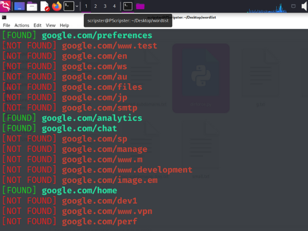

# DirForce


DirForce is a directory brute force tool developed by Shashwat Singhal. It allows users to discover hidden directories on a target website using a wordlist. The tool supports multithreading to enhance scanning speed and provides real-time results.

## Technologies Used
- Python
- Requests
- Pyfiglet
- Colorama
- Threading

## Project Description

DirForce consists of a single Python script (`dirforce.py`) that takes a target URL and a wordlist of potential directories, and attempts to find accessible directories on the target website. It provides colored output for found and not found directories and saves the found results to an output file.

## Setup and Usage

### Prerequisites
- Python installed on the machine.
- A wordlist file containing potential directory names.

### Download and Run

1. **Clone the repository and navigate to the project directory**:
   ```sh
   git clone https://github.com/Shashwat1218/DirForce.git
   cd <repository_directory>
   pyhton3 DirForce.py

### [NOT FOUND]

### [FOUND]

### Output File

